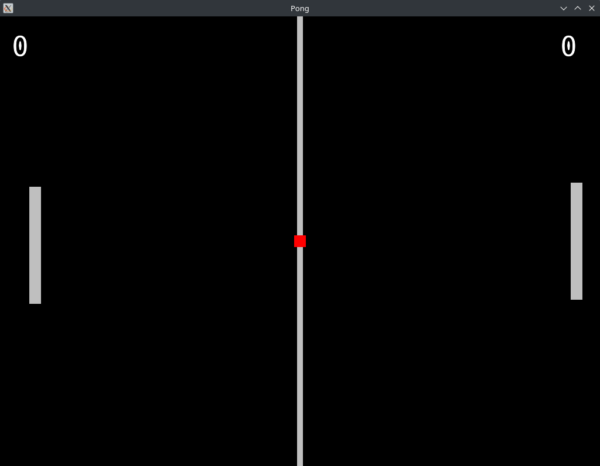

# Pong

Designed over the top of the Lone Wolf Engine. Meant to display the 2D functionality, and ease-of-use of the API.
The Lone Wolf Engine was designed from the ground, up from scratch. Very few libraries are linked to this engine.

## Planned Features

- Multiplayer
- Graphical User Interface